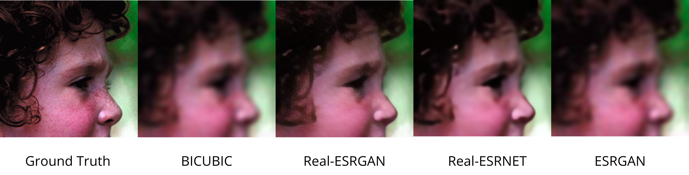
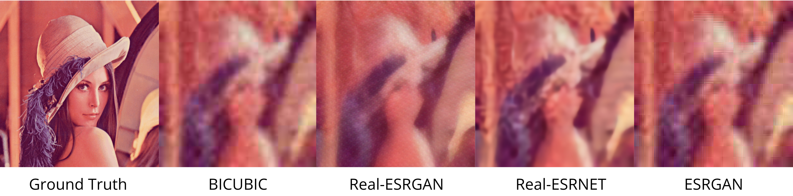
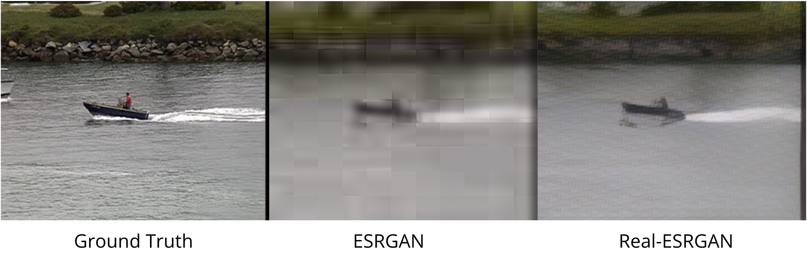

# Example

## Overview

- This is a pytorch-lightning version of [Real-ESRGAN](https://github.com/xinntao/Real-ESRGAN).
- You can reproduce the outcome by the following steps.
- Reference: [Real-ESRGAN: Training Real-World Blind Super-Resolution with Pure Synthetic Data](https://arxiv.org/pdf/2107.10833.pdf)

## How to use

### Environment

- Python version: 3.9.13
- GPU: V100

### Train Real-ESRNET

- To reproduce pretraining Real-ESRNET loaded from ESRGAN's net.

```shell
CUDA_VISIBLE_DEVICES=0 python train.py --do_pretrain \
	--real \
	--batch_size 12 \
	--accumulate 4 \
	--pretrain_steps 4000000 \
	--eval_epoch 10 \
	--lr 2e-4 \
	--model_path model/ESRGAN_SRx4_DF2KOST_official-ff704c30.pth
```

| Parameters      | Description                                                  |
| --------------- | ------------------------------------------------------------ |
| `--do_pretrain` | Whether to run pretraining.                                  |
| `--do_train`    | Whether to run training.                                     |
| `--do_predict`  | Whether to run prediction.                                   |
| `--real`        | Use the archtitecture of Real-ESRGAN when this is given, otherwise, using ESRGAN. |
| `--model_path`  | The path of generator.                                       |

- During training, trainer will save top 5 model based on PSNR of eval dataset.
- The generator model will be saved as generator.pt, could be loaded on the GAN training process.

### Train Real-ESRGAN

- To reproduce training Real-ESRGAN based on the generator we just trained.

```shell
CUDA_VISIBLE_DEVICES=0 python train.py \
	--do_train \
	--real \
	--batch_size 8 \
	--accumulate 6 \
	--step 2400000 \
	--eval_epoch 10 \
	--lr 1e-4 \
	--model_path model/generator.pt
```

- During training, trainer will save the last model every eval_epoch.

### Inference

- To produce high-resolution images via our model.

```shell
CUDA_VISIBLE_DEVICES=$1 python train.py \
	--real \
	--do_predict \
	--model_path model/Real-ESRGAN.pt \
	--valid_data_dir data/Set14_HR \
	--output_dir img/real_esrgan_high \
	--steps 10000 \
	--epoch 1 \
	--batch_size 1
```

## Result








